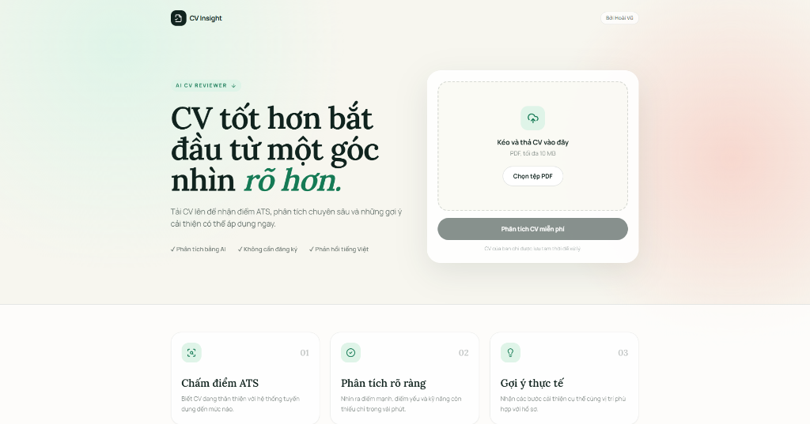

# AI CV Reviewer

A web app that analyzes PDF resumes with Gemini 2.5 Flash, scores ATS readiness, and returns concise Vietnamese feedback.

## Cong nghe

- Frontend: Next.js 15, TypeScript, Tailwind CSS, Radix UI
- Backend: FastAPI, PyMuPDF, Gemini REST API
- Trien khai: Vercel (frontend), Render (backend)

## Bien moi truong

| Ung dung | Bien | Mo ta |
|---|---|---|
| Backend | `GEMINI_API_KEY` | API key bat buoc cua Google Gemini |
| Backend | `GEMINI_MODEL` | Mac dinh `gemini-2.5-flash` |
| Backend | `FRONTEND_URL` | Domain frontend duoc phep goi API |
| Backend | `UPLOAD_DIR` | Thu muc luu PDF tam thoi; mac dinh dung temp directory cua he dieu hanh |
| Frontend | `NEXT_PUBLIC_API_URL` | URL public cua FastAPI backend |

## Deploy

1. Deploy backend len Render bang `render.yaml`.
2. Tren Render, cau hinh `GEMINI_API_KEY` va `FRONTEND_URL`.
3. Deploy thu muc `frontend` len Vercel.
4. Tren Vercel, cau hinh `NEXT_PUBLIC_API_URL` thanh URL backend Render.
5. Cap nhat `FRONTEND_URL` tren Render thanh domain Vercel roi redeploy backend.

## Ghi chu

- PDF gioi han 10 MB.
- File PDF duoc xoa khoi backend ngay sau mot lan phan tich.
- Phien ban hien tai doc PDF co lop van ban, chua OCR CV dang anh.
